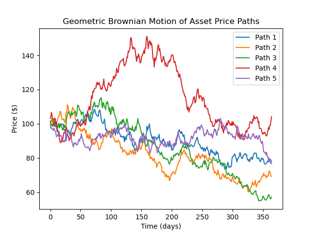



# Option Pricing using a Monte Carlo Simulation

This project prices European options using the Monte Carlo method.  This simulation uses geometric Brownian motion to simulate asset prices. Additions are in the pipeline to allow for the pricing of more complex options.

## Table of Contents
* [Introduction](#introduction) 
* [Methodology](#methodology) 
* [Installation](#installation) 
* [Dependencies](#dependencies)
* [Contributing](#contributing) 
* [License](#license) 

## Introduction

Monte Carlo Simulation is a powerful numerical technique used in quantitative finance to model the randomness of financial instruments. This project focuses on the pricing of European calls and puts by running repeated simulations of the price of the underlying asset.

In order to model the behaviour of the underlying, we assume that the asset follows a [Geometric Brownian Motion](https://en.wikipedia.org/wiki/Geometric_Brownian_motion), governed  by the *stochastic differential equation*: $$\frac{dS_{t}}{S_{t}} = \mu dt + \sigma dW_{t} \hspace*{#1} (1)$$ where $S_t$ is the price of the underlying asset at time $t$, $\mu$ is the drift of the Brownian motion, $\sigma$ is its volatility and $dW_{t}$ follows a normal distribution with mean $0$ and standard deviation $\sqrt{dt}$. 

## Methodology

### Parameters
* **S_0**: Initial asset price
* **mu**: Asset drift (average rate  of return)
* **sig**: Volatility
* **dt**: time-step size 
* **num_paths**: Number of simulations to run
* **E**: Option strike price
* **interest_rate**: Risk-free interest rate
* **time_to_expiry**: Time to option expiration

### Output
The program will print the  Monte Carlo estimate of the price of a European call and put based on the above parameters.

### Implementation Overview

1.  **Asset prices**: Asset price dynamics are modelled using $(1)$ with discretised time steps. In order to allow for scalability, the random asset paths were vectorised in the following fashion:
	* A matrix of random increments $\mathrm{d}\mathbf{W}$ was defined, where each element $(dW)_{ij}$ represents  the random increment  of the $j$ th time-step of the $i$ th simulation.
	* The matrix of simulated price paths is then computed using a vectorised version of the formula $S_t = S_{0}e^{\mu dt+\sigma dW_t}$.

2. **Option pay-offs**:  For each price path, the payoff of the call and put at expiry (final simulated price) is calculated.
3. **Discount future pay-offs**: Each of the simulated future payoffs is discounted to the present value using the risk-free interest rate.
4. **Calculate options' value**:  The average of the discounted payoffs is calculated. The result is the Monte Carlo estimate of the options' value.

### Simulated Asset Paths Illustration:
An example of some simulated asset price paths with $S_0 = 100$, $\mu = 0.1$ and $\sigma  = 0.3$ (for clarity the number of paths in this illustration was limited to 5; in practice that number is of the order of $10^{5}$):



## Installation

1. Clone the repository:
	```bash
	git clone https://github.com/mikereg/Monte-Carlo-Option-Pricing
	```
2.  Navigate to the project directory:

	```bash
	cd monte-carlo-option-pricing
	```
3. Open and modify the `monte_carlo_option_pricing.py` file to adjust parameters such as the initial stock price, drift, volatility, time step, number of simulations, interest rate, and time to expiration.
    
4.  Run the simulation:

```bash
python European_Options.py
```

5.  View the generated asset price paths and the Monte Carlo estimate of the option price.

## Dependencies
* NumPy
* Matplotlib

## Contributing

Feel free to contribute to the project by opening issues or submitting pull requests.

## License
[MIT](https://choosealicense.com/licenses/mit/)

